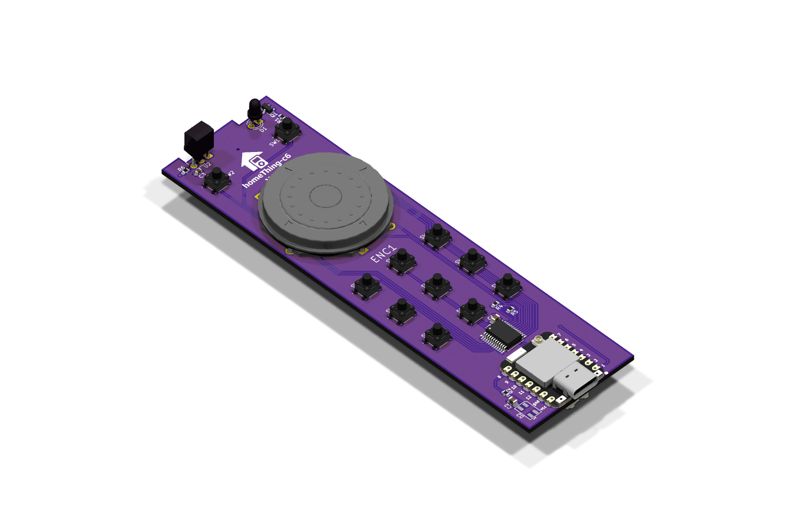
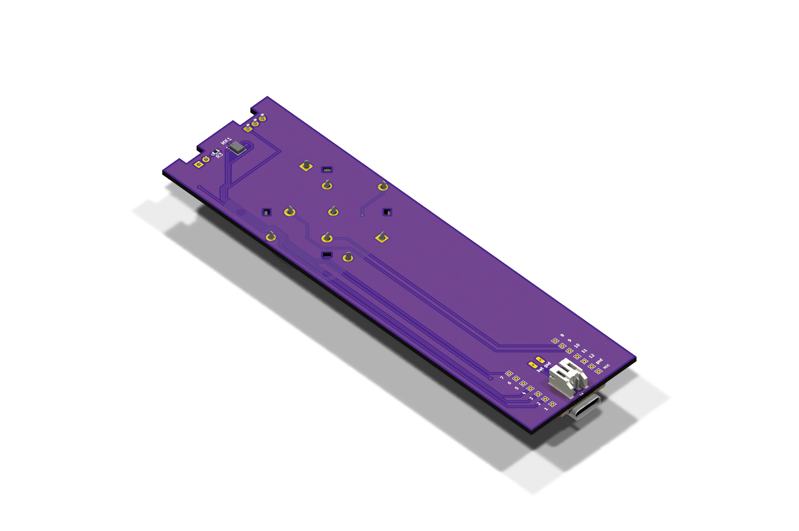
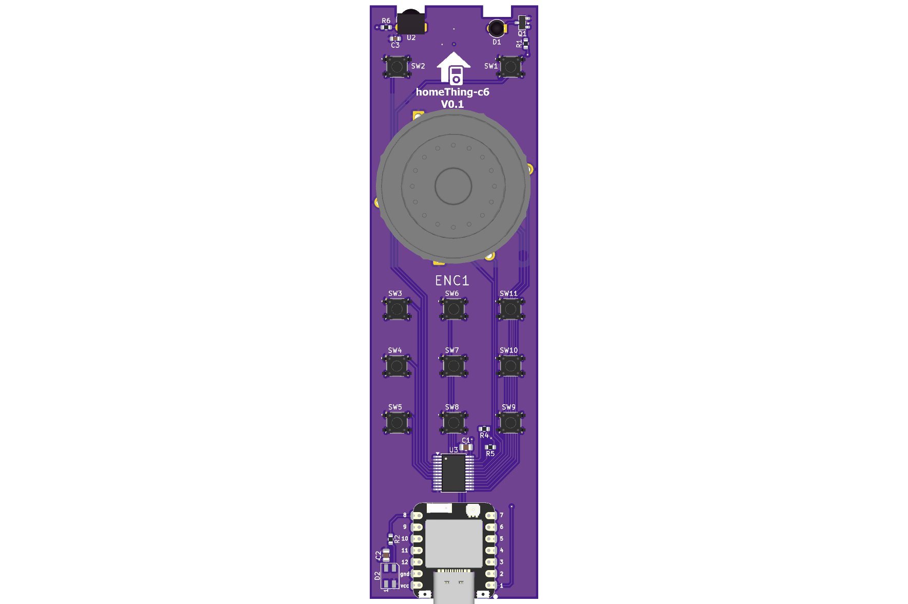
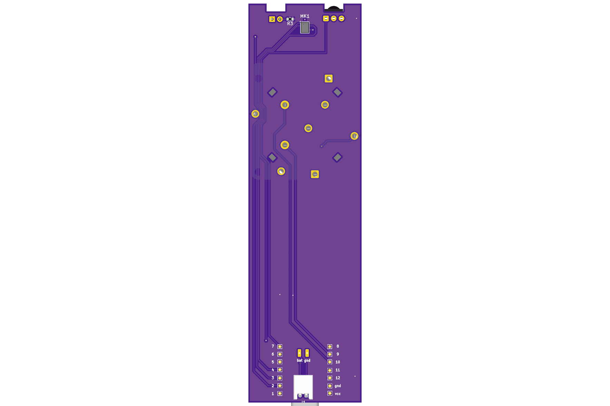

<p align="center">
  <picture>
    <source media="(prefers-color-scheme: dark)" srcset="docs/readme-assets/homeThingLogoWhite.svg">
    
  </picture>
</p>

# homeThing C6

A handheld remote for TV, Sonos, zigbee lights, and Home Assistant. No touchscreen, no digging through apps, no device that has to live on a charger. Physical buttons, a rotary control, fast access, and long idle life.

This repo is the hardware side of that project. The source of truth lives in `c6remote-kicad/`. Current design is a KiCad prototype built around a Seeed Studio XIAO ESP32-C6.

## Learn More

- [Discord](https://discord.gg/BX6ZtGKHTy)
- [Instagram](https://www.instagram.com/homething.io/)
- [Website](https://homething.io/)

## Raytraced Views

| View | Top | Bottom |
| --- | --- | --- |
| High 3D |  |  |

## Board Views

| View | Top | Bottom |
| --- | --- | --- |
| Basic 3D |  |  |
| Flat SVG |  |  |

## Schematic


## What this remote is meant to do

- Control a TV through on-board IR receive and transmit hardware
- Handle Sonos and other music controls once firmware and Home Assistant integration land
- Use the ESP32-C6 for Zigbee, Thread, or Matter-adjacent control work
- Map Home Assistant actions to physical buttons instead of app screens
- Last longer than the usual "charge it every week" gadget

This is not a finished product yet. Right now this repo is about the hardware prototype. Firmware, battery tuning, UX, and the full integration story still come later.

## Current hardware

Board in `c6remote-kicad/` currently includes:

- [Seeed Studio XIAO ESP32-C6](https://www.digikey.ca/en/products/detail/seeed-technology-co-ltd/113991254/24613066) (`U1`)
- [ICS-43434 I2S microphone](https://www.digikey.ca/en/products/detail/tdk-invensense/ICS-43434/6140298) (`MK1`)
- [TSOP4536 IR receiver](https://www.digikey.ca/en/products/detail/vishay-semiconductor-opto-division/TSOP4536/4695671) (`U2`) and [IR204-A IR LED](https://www.digikey.ca/en/products/detail/everlight-electronics-co-ltd/IR204-A/2675566) (`D1`) through [MMBT2222A,215](https://www.digikey.ca/en/products/detail/nexperia-usa-inc/MMBT2222A-215/1156598) (`Q1`)
- [PCF8575DBR I2C GPIO expander](https://www.digikey.com/en/products/detail/texas-instruments/PCF8575DBR/754551) (`U3`)
- [TL3315NF160Q tactile switches](https://www.digikey.ca/en/products/detail/e-switch/TL3315NF160Q/1870395) (`SW1` through `SW11`)
- [Adafruit ANO Directional Navigation and Scroll Wheel Rotary Encoder](https://www.adafruit.com/product/5001) (`ENC1`) with encoder channels and five switch signals
- [Adafruit 2686 / SK6812 mini addressable status LED pack](https://www.digikey.ca/en/products/detail/adafruit-industries-llc/2686/5804107) (`D2`)

In practice, that gives the board a lot of physical input options plus IR and wireless paths for mixed home gear.

## BOM

Latest auto-generated BOM:

- CSV: [c6remote-kicad/export/c6remote-bom.csv](c6remote-kicad/export/c6remote-bom.csv)

This BOM tracks latest repo state and is not release-validated.

## Repo layout

```text
.
├── c6remote-kicad/          Main KiCad project
│   ├── c6remote.kicad_sch   Schematic
│   ├── c6remote.kicad_pcb   PCB layout
│   ├── c6remote.kicad_pro   Project settings
│   ├── 3dmodels/            STEP models used for 3D board view
│   └── export/              Generated fabrication outputs
├── kicad lib/Library.pretty Custom PCB footprints used by board
└── ano rotary.kicad_sym     Project-local schematic symbol library
```

## Open project

Open `c6remote-kicad/c6remote.kicad_pro` in KiCad.

Project uses local custom footprints under `kicad lib/Library.pretty/`. KiCad needs that footprint library to resolve under nickname `Library`.

## 3D models

Project also uses local STEP models under `c6remote-kicad/3dmodels/` for 3D preview.

3D model files in `c6remote-kicad/3dmodels/`:

- `5221 ANO Rotary Encoder.step` — ANO rotary model source: [GrabCAD Adafruit 5001 ANO Rotary Encoder](https://grabcad.com/library/adafruit-5001-ano-rotary-encoder-1)
- `SW_SPST_PTS647Sx50_black.step` — local forked STEP model matching [C&K PTS647 series](https://www.ckswitches.com/products/switches/product-details/Tactile/PTS647/)
- `Seeed Studio XIAO ESP32-C6.step` — XIAO model source: [GrabCAD XIAO ESP32-C6 3D model](https://grabcad.com/library/seeed-studio-xiao-esp32-c6-1)

Symbol libraries are registered in `c6remote-kicad/sym-lib-table`:

- `ano rotary` — project-local custom rotary symbol (`ano rotary.kicad_sym`), sourced from [Adafruit ANO Directional Navigation and Scroll Wheel Rotary Encoder](https://www.adafruit.com/product/5001)
- `Seeed_Studio_XIAO_Series` — XIAO module symbols (`Seeed_Studio_XIAO_Series.kicad_sym`), sourced from [Seeed-Studio/OPL_Kicad_Library](https://github.com/Seeed-Studio/OPL_Kicad_Library/tree/master/Seeed%20Studio%20XIAO%20Series%20Library)

## KiCad MCP

This repo is set up to use same KiCad MCP server with Codex, Claude Desktop, and GitHub Copilot / VS Code.

- Codex workspace config: `.mcp.json`
- VS Code / Copilot workspace config: `.vscode/mcp.json`
- Claude Desktop example config: `docs/claude-desktop-config.example.json`

Full setup notes live in [docs/mcp-setup.md](docs/mcp-setup.md).

## Validation

Run from `c6remote-kicad/`:

```bash
/Applications/KiCad/KiCad.app/Contents/MacOS/kicad-cli sch erc c6remote.kicad_sch --exit-code-violations
/Applications/KiCad/KiCad.app/Contents/MacOS/kicad-cli pcb drc c6remote.kicad_pcb --exit-code-violations
/Applications/KiCad/KiCad.app/Contents/MacOS/kicad-cli pcb drc c6remote.kicad_pcb --schematic-parity --refill-zones --exit-code-violations
```

To regenerate fabrication outputs:

```bash
/Applications/KiCad/KiCad.app/Contents/MacOS/kicad-cli pcb export gerbers c6remote.kicad_pcb -o export --board-plot-params
```

To regenerate BOM CSV:

```bash
/Applications/KiCad/KiCad.app/Contents/MacOS/kicad-cli sch export bom --fields 'Reference,${QUANTITY},Value,Footprint,Datasheet,Description,Manufacturer,MPN,SKU' --labels 'Reference,Qty,Value,Footprint,Datasheet,Description,Manufacturer,MPN,SKU' --group-by 'Value,Footprint,Datasheet,Description,Manufacturer,MPN,SKU' --ref-delimiter ', ' --ref-range-delimiter '' -o export/c6remote-bom.csv c6remote.kicad_sch
```

To render reusable 2D board views:

```bash
./scripts/render-2d.sh
./scripts/render-2d.sh --side top
./scripts/render-2d.sh --side bottom --format pdf
```

Default output goes to `c6remote-kicad/renders/<format>/`.

To regenerate README preview assets in one shot:

```bash
./scripts/render-readme-assets.sh
```

Default output goes to `docs/readme-assets/`.
Includes `board-3d-top.png`, `board-3d-bottom.png`, `board-flat-top.svg`, `board-flat-bottom.svg`, and `schematic.svg`.

## Current status

- Prototype board, not finished remote
- KiCad source of truth lives in `c6remote-kicad/`
- Generated fabrication outputs live in `c6remote-kicad/export/`
- Current baseline still has ERC and DRC warnings, but board has not been tested in a real order yet
- Firmware and runtime integrations are not in this repo yet

## Why this lives separately from homeThing

Original inspiration came from [homeThing](https://github.com/landonr/homeThing).

This repo has a narrower job:

- Less "general smart display"
- More "grab remote, hit button, control house"
- Custom PCB around ESP32-C6
- Easier to own and iterate in KiCad

If question is "why build this at all?", answer is still pretty straightforward: one remote for TV, music, lights, and Home Assistant, without a charger becoming part of the routine.
