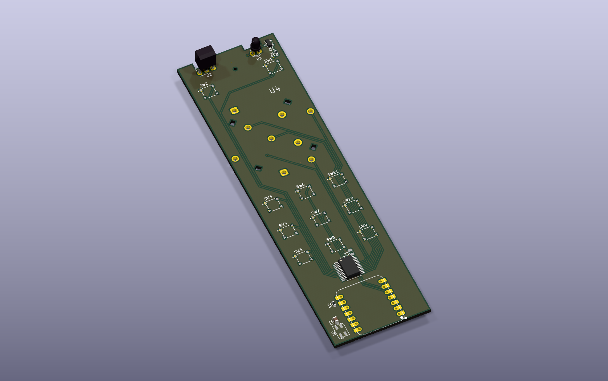

# c6homeThing

Remote for real house control.

Goal: pick up one handheld remote, control TV, Sonos music, Zigbee lights, and Home Assistant services, then put it down again. No touchscreen. No weekly charging ritual. Physical buttons, rotary control, fast access, long idle life.

This repo is hardware side of that idea. Source of truth lives in `c6remote-kicad/`. Current design is KiCad prototype built around Seeed Studio XIAO ESP32-C6.



## What this remote is for

- **TV control** through on-board IR receive/transmit hardware
- **Sonos and music control** through firmware and Home Assistant integration work that comes later
- **Zigbee / Thread / Matter-class control** on ESP32-C6 platform
- **Home Assistant actions** mapped to real buttons instead of app screens
- **Better battery life target** than "charge it every week" devices

Not finished product yet. Hardware prototype first. Firmware, battery tuning, UX, and full integration still follow-on work.

## Hardware in current board

Current board in `c6remote-kicad/` has:

- **MCU:** Seeed Studio XIAO ESP32-C6 (`U1`)
- **Audio input:** I2S microphone (`M1`)
- **IR:** TSOP45xx-style receiver (`U2`) and IR LED transmitter (`D1`) through `Q1`
- **Input expansion:** PCF8575 I2C GPIO expander (`U3`)
- **Buttons:** discrete switches `sw1` through `sw11`
- **Rotary control:** custom "Ano Rotary" part (`U4`) with encoder channels plus five switch signals
- **Status LED:** SK6812 mini addressable LED (`D2`)

High level: enough physical inputs for fast scene/media control, plus wireless/IR paths for mixed home gear.

## Repo layout

```text
.
├── c6remote-kicad/          Main KiCad project
│   ├── c6remote.kicad_sch   Schematic
│   ├── c6remote.kicad_pcb   PCB layout
│   ├── c6remote.kicad_pro   Project settings
│   └── export/              Generated fabrication outputs
├── kicad lib/Library.pretty Custom footprints used by board
└── ano rotary.kicad_sym     Project-local custom symbol library
```

## Open project

Open `c6remote-kicad/c6remote.kicad_pro` in KiCad.

Project uses local custom footprints under `kicad lib/Library.pretty/`. Footprint library nickname must resolve as **`Library`**.

## Validation

Run from `c6remote-kicad/`:

```bash
/Applications/KiCad/KiCad.app/Contents/MacOS/kicad-cli sch erc c6remote.kicad_sch --exit-code-violations
/Applications/KiCad/KiCad.app/Contents/MacOS/kicad-cli pcb drc c6remote.kicad_pcb --exit-code-violations
/Applications/KiCad/KiCad.app/Contents/MacOS/kicad-cli pcb drc c6remote.kicad_pcb --schematic-parity --refill-zones --exit-code-violations
```

Regenerate fabrication outputs:

```bash
/Applications/KiCad/KiCad.app/Contents/MacOS/kicad-cli pcb export gerbers c6remote.kicad_pcb -o export --board-plot-params
```

## Current status

- **Prototype board**, not finished remote
- **KiCad source of truth** in `c6remote-kicad/`
- **Generated fab outputs** in `c6remote-kicad/export/`
- **Known ERC/DRC issues** still present in current baseline
- **Firmware and runtime integrations** not in this repo yet

## Why separate from homeThing

Original inspiration: [homeThing](https://github.com/landonr/homeThing).

This repo narrows mission:

- less "general smart display"
- more "grab remote, hit button, control house"
- custom PCB around ESP32-C6
- easier ownership and iteration in KiCad

If core question is "why build this?" — answer is simple: one remote for TV, music, lights, and Home Assistant, without living on charger.
