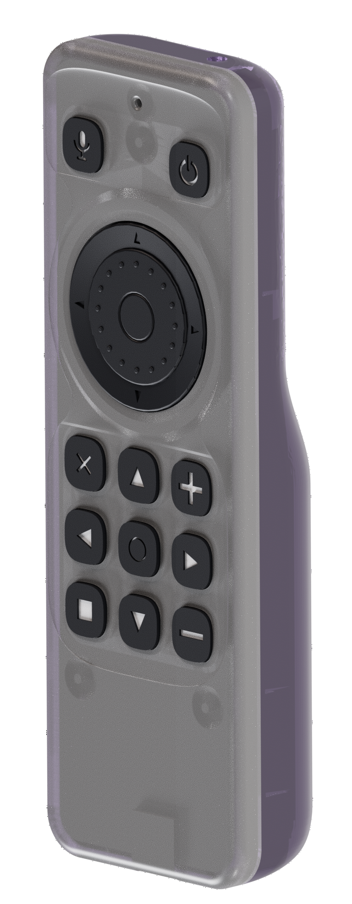
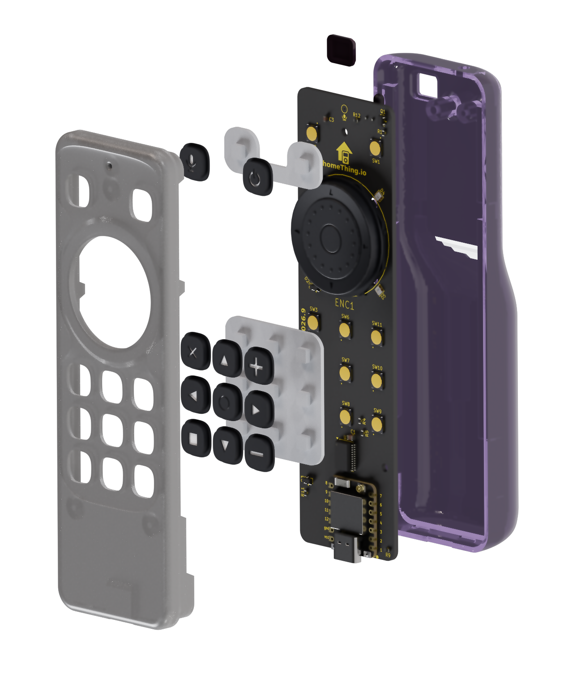

  <picture>
    <source media="(prefers-color-scheme: dark)" srcset="docs/readme-assets/homeThingLogoWhite.svg">
    
  </picture>

<h1 align="center">homeThing C6</h1>

  A handheld remote for TV, Sonos, Zigbee lights, and Home Assistant. 
  Physical buttons, a rotary control, fast access, and long idle life. No touchscreen, no apps, no daily charging.

  
  
  
  

  Prototype and fab costs sponsored by <a href="https://pcbway.com/g/Xymq6O">PCBWay</a>. Boards arrive fully assembled, no soldering required.
   
  

## Summary

- **Case:** The [`case/` README](case/README.md) documents the enclosure files and assembly information.
- **Board:** The [`c6remote-kicad/` README](c6remote-kicad/README.md) documents the KiCad hardware source.
- **Firmware:** The [firmware section](#firmware) documents the ESPHome configuration and local components.
- **Scripts:** The [`scripts/` README](scripts/README.md) documents project utilities and generated assets.

The prototype uses a Seeed Studio XIAO ESP32-C6.

### Features

- Control a TV with on-board IR receive and transmit hardware
- Drive music playback over Wi-Fi and BLE
- Switch lights over Zigbee, Thread, or Matter
- Map Home Assistant actions to physical buttons instead of app screens
- Assign every button from a web page on the remote itself
- Run for a long time between charges

## Case

  

Assembled case

  

Exploded view: front shell, button caps, silicone pads, board, and back shell

## Board ([more info](c6remote-kicad/README.md))

### PCB and hardware

  
  

Raytraced renders, top and bottom

#### Top

| Render | Copper |
| :---: | :---: |
|  |  |

#### Bottom

| Render | Copper |
| :---: | :---: |
|  |  |

| Ref | Part | Role |
| --- | --- | --- |
| `U1` | [Seeed Studio XIAO ESP32-C6](https://mm.digikey.com/Volume0/opasdata/d220001/medias/docus/8932/102010636.pdf) | Main module: Wi-Fi, BLE, Zigbee/Thread |
| `MK1` | [DMM-4026-B-I2S-R I2S microphone](https://api.puiaudio.com/filename/DMM-4026-B-I2S-R.pdf) | Audio input: PUI Audio bottom-port MEMS part on the back copper, hearing through a 0.5mm NPTH. `LR` and `CONFIG` tie to ground for left-channel output, `C5` decouples VDD and `R12` pulls `sd` down. It replaced the ICS-43434 on 2026-09-07, after three of the five rev-B microphones failed |
| `U2` | [TSOP6136 IR receiver](https://www.vishay.com/docs/82457/tsop61.pdf) | IR receive: Vishay Panhead SMD part on the back copper, listening out the top end wall. AGC1, the most permissive of Vishay's settings, which is what lets `remote_receiver` learn arbitrary remotes. VDD sits on the switched `ir_vdd` rail rather than straight on `+3.3V`, gated by `Q3` below |
| `D1`, `Q1` | [INL-3AHIR30 IR LED](http://www.inolux-corp.com/datasheet/IR/Emitter/3mm%20Lamp/INL-3AHIR30_V1.0.pdf) driven by [MMBT2222A](https://assets.nexperia.com/documents/data-sheet/MMBT2222A.pdf) | IR transmit; D1 leads hand-bent 90° to fire through the top-edge notch (see `BEND 90°` silk mark) |
| `U3` | [PCF8575DBR I2C GPIO expander](https://www.ti.com/lit/ds/symlink/pcf8575.pdf) | Button input fan-out |
| `SW1`–`SW11` | [TL3315NF160Q tactile switches](https://www.e-switch.com/wp-content/uploads/2022/06/TL3315.pdf) | Discrete buttons |
| `ENC1` | [Adafruit ANO rotary encoder](https://cdn-learn.adafruit.com/assets/assets/000/104/942/original/tsw.pdf) | Scroll wheel: encoder channels plus five switch signals |
| `D2`–`D5` | [XL-2020RGBC-WS2812B addressable LEDs](https://mm.digikey.com/Volume0/opasdata/d220001/medias/docus/8903/5962_XL-2020RGBC-WS2812B.pdf) | Status light chain of 4, WS2812B protocol: `GPIO17` drives `D2` DIN, DOUT cascades to `D5`. VDD sits on the switched `led_vdd` rail rather than straight on `+3.3V`, gated by `Q2` below, with `C4` as the only bulk cap on the chain (see [`docs/timeline.md`](docs/timeline.md)) |
| `Q2`, `R10`, `C4` | [AO3401A P-channel MOSFET](https://www.aosmd.com/res/datasheets/AO3401A.pdf), 1M 0603 pull-up, 1µF X7R 0805 cap | LED rail load switch: high-side `Q2` gates `+3.3V` (source) onto `led_vdd` (drain) for `D2`–`D5`, gate net `led_en` on `U1` pad 11 (`GPIO18`/`D10`), driven low for rail on. `R10` pulls the gate to the source so the rail is off by default at boot while `GPIO18` floats as an input; `C4` is the mid-chain bulk cap on `led_vdd`. Cuts the ~2.0mA the LEDs burned when dark to tens of µA (calculated, not yet measured). Firmware must hold `GPIO17` low or high-impedance whenever the rail is down, or DIN pushes current into the dead rail |
| `J1` | [JST S2B-PH-SM4-TB(LF)(SN)](https://www.jst-mfg.com/product/pdf/eng/ePH.pdf) | Battery connector, PH series right-angle SMD |

The auto-generated BOM lives at [c6remote-kicad/export/c6remote-bom.csv](c6remote-kicad/export/c6remote-bom.csv). It tracks the latest repo state and is not release-validated.

### Schematic

## Firmware

### Button assignment

Open `http://homething-c6.local/buttons` in a browser on the same network.
The page draws the remote layout. Select an input, then assign IR, Zigbee, BLE HID, or voice.
You can also clear the input. Hold `SW1` for two seconds to use the on-device assignment mode.
[`RECEIVER.md`](RECEIVER.md) documents both routes. The page has no password, so use it only on a trusted network.

## Status

The fabrication and bring-up history, the rev-B delivery, and the unit 1 versus current design comparison are in [`docs/timeline.md`](docs/timeline.md). Open work is in [`ROADMAP.md`](ROADMAP.md). The power budget is in [`docs/power-budget.md`](docs/power-budget.md).

## Relationship to homeThing

This project grew out of [homeThing](https://github.com/landonr/homeThing) but has a narrower job: instead of a general smart display, it is a simple dedicated remote. It has no screen and more buttons, and is built on a custom PCB that is easy to build.

# Includes
- <a href="https://esphome.io/">ESPHome</a>
- <a href="https://dejavu-fonts.github.io/">DejaVu Sans Bold</a>, used for the board silkscreen brand text
- [@luar123](https://github.com/luar123)'s <a href="https://github.com/luar123/zigbee_esphome">Zigbee ESPHome component</a>
- <a href="https://www.kicad.org/">KiCad</a>
- <a href="https://github.com/landonr/homeThing">homeThing</a>

# Sponsorship

## [PCBWay](https://pcbway.com/g/Xymq6O "PCBWay") sponsors 3D Printing and PCB assembly costs on this project during the prototyping phase! 
If you are interested in their awesome fabrication services please check them out.&nbsp; They offer 

3D prototyping,&nbsp;PCB design and assembly, as well as CNC metal fabrication.&nbsp; Costs are reasonable and the quality is as good as it gets.&nbsp; Thank you PCBWay for sponsoring us and other fun projects!  

## [cargo](https://cargo.site/ "cargo.site") sponsors our website!

They make it super easy to keep things pretty and up to date! It’s honestly so much easier than managing our own site, highly recommended!
