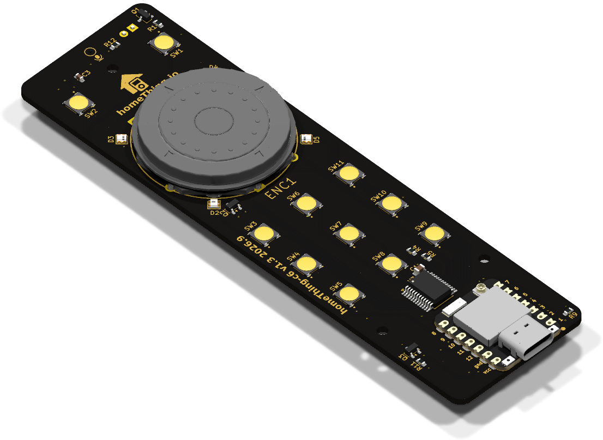
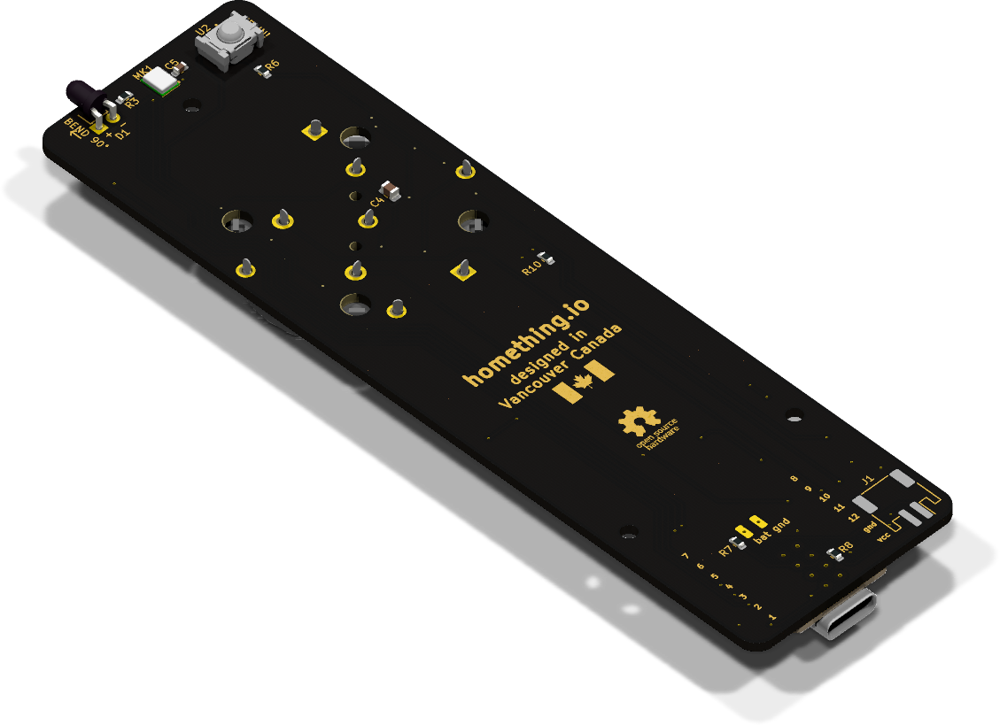

<p align="center">
  <picture>
    <source media="(prefers-color-scheme: dark)" srcset="docs/readme-assets/homeThingLogoWhite.svg">
    
  </picture>
</p>

<h1 align="center">homeThing C6</h1>

<p align="center">
  A handheld remote for TV, Sonos, Zigbee lights, and Home Assistant.<br>
  Physical buttons, a rotary control, fast access, and long idle life. No touchscreen, no apps, no daily charging.
</p>

<p align="center">
  <a href="https://discord.gg/BX6ZtGKHTy"></a>
  <a href="https://www.instagram.com/homething.io/"></a>
  <a href="https://homething.io/"></a>
  <a href="https://github.com/landonr/homeThing"></a>
</p>

<p align="center">
  <sub>Prototype and fab costs sponsored by <a href="https://pcbway.com/g/Xymq6O">PCBWay</a>. Boards arrive fully assembled, no soldering required.</sub>
  <br>
  <a href="https://pcbway.com/g/Xymq6O"></a>
</p>

This repo contains the KiCad hardware and ESPHome bring-up configuration for a prototype built around a Seeed Studio XIAO ESP32-C6. The hardware source of truth lives in `c6remote-kicad/`.

<p align="center">
  
  
</p>
<p align="center"><sub>Raytraced renders, top and bottom</sub></p>

## Features

- Control a TV with on-board IR receive and transmit hardware
- Drive music playback over Wi-Fi and BLE
- Switch lights over Zigbee, Thread, or Matter
- Map Home Assistant actions to physical buttons instead of app screens
- Run for a long time between charges

## Hardware

| Ref | Part | Role |
| --- | --- | --- |
| `U1` | [Seeed Studio XIAO ESP32-C6](https://mm.digikey.com/Volume0/opasdata/d220001/medias/docus/8932/102010636.pdf) | Main module: Wi-Fi, BLE, Zigbee/Thread |
| `MK1` | [ICS-43434 I2S microphone](https://invensense.tdk.com/wp-content/uploads/2016/02/DS-000069-ICS-43434-v1.2.pdf) | Audio input |
| `U2` | [TSOP6136 IR receiver](https://www.vishay.com/docs/82457/tsop61.pdf) | IR receive: Vishay Panhead SMD part on the back copper, listening out the top end wall. AGC1, the most permissive of Vishay's settings, which is what lets `remote_receiver` learn arbitrary remotes. VDD sits on the switched `ir_vdd` rail rather than straight on `+3.3V`, gated by `Q3` below |
| `D1`, `Q1` | [INL-3AHIR30 IR LED](http://www.inolux-corp.com/datasheet/IR/Emitter/3mm%20Lamp/INL-3AHIR30_V1.0.pdf) driven by [MMBT2222A](https://assets.nexperia.com/documents/data-sheet/MMBT2222A.pdf) | IR transmit; D1 leads hand-bent 90° to fire through the top-edge notch (see `BEND 90°` silk mark) |
| `U3` | [PCF8575DBR I2C GPIO expander](https://www.ti.com/lit/ds/symlink/pcf8575.pdf) | Button input fan-out |
| `SW1`–`SW11` | [TL3315NF160Q tactile switches](https://www.e-switch.com/wp-content/uploads/2022/06/TL3315.pdf) | Discrete buttons |
| `ENC1` | [Adafruit ANO rotary encoder](https://cdn-learn.adafruit.com/assets/assets/000/104/942/original/tsw.pdf) | Scroll wheel: encoder channels plus five switch signals |
| `D2`–`D5` | [XL-2020RGBC-WS2812B addressable LEDs](https://mm.digikey.com/Volume0/opasdata/d220001/medias/docus/8903/5962_XL-2020RGBC-WS2812B.pdf) | Status light chain of 4, WS2812B protocol: `GPIO17` drives `D2` DIN, DOUT cascades to `D5`. VDD sits on the switched `led_vdd` rail rather than straight on `+3.3V`, gated by `Q2` below, with `C4` as the only bulk cap on the chain (see `ROADMAP.md`) |
| `Q2`, `R10`, `C4` | [AO3401A P-channel MOSFET](https://www.aosmd.com/res/datasheets/AO3401A.pdf), 1M 0603 pull-up, 1µF X7R 0805 cap | LED rail load switch: high-side `Q2` gates `+3.3V` (source) onto `led_vdd` (drain) for `D2`–`D5`, gate net `led_en` on `U1` pad 11 (`GPIO18`/`D10`), driven low for rail on. `R10` pulls the gate to the source so the rail is off by default at boot while `GPIO18` floats as an input; `C4` is the mid-chain bulk cap on `led_vdd`. Cuts the ~2.0mA the LEDs burned when dark to tens of µA (calculated, not yet measured). Firmware must hold `GPIO17` low or high-impedance whenever the rail is down, or DIN pushes current into the dead rail |
| `J1` | [JST S2B-PH-SM4-TB(LF)(SN)](https://www.jst-mfg.com/product/pdf/eng/ePH.pdf) | Battery connector, PH series right-angle SMD |

The auto-generated BOM lives at [c6remote-kicad/export/c6remote-bom.csv](c6remote-kicad/export/c6remote-bom.csv). It tracks the latest repo state and is not release-validated.

## Board views

<p align="center">
  
  &nbsp;&nbsp;
  
</p>
<p align="center"><sub>Top: basic 3D and flat copper</sub></p>

<p align="center">
  
  &nbsp;&nbsp;
  
</p>
<p align="center"><sub>Bottom: basic 3D and flat copper</sub></p>

## Schematic


## Repo layout

```text
.
├── c6remote-kicad/          Main KiCad project
│   ├── c6remote.kicad_sch   Schematic
│   ├── c6remote.kicad_pcb   PCB layout
│   ├── c6remote.kicad_pro   Project settings
│   ├── 3dmodels/            STEP models used for 3D board view
│   └── export/              Generated fabrication outputs
├── kicad lib/Library.pretty Custom PCB footprints used by board
└── ano rotary.kicad_sym     Project-local schematic symbol library
```

## Opening the project

Open `c6remote-kicad/c6remote.kicad_pro` in KiCad. The board uses local custom footprints under `kicad lib/Library.pretty/`, which KiCad must resolve under the library nickname `Library`.

Symbol libraries are registered in `c6remote-kicad/sym-lib-table`:

- `ano rotary`: project-local custom rotary symbol (`ano rotary.kicad_sym`) for the [Adafruit ANO rotary encoder](https://www.adafruit.com/product/5001)
- `Seeed_Studio_XIAO_Series`: XIAO module symbols from [Seeed-Studio/OPL_Kicad_Library](https://github.com/Seeed-Studio/OPL_Kicad_Library/tree/master/Seeed%20Studio%20XIAO%20Series%20Library)

STEP models for the 3D board view live in `c6remote-kicad/3dmodels/`:

- `5221 ANO Rotary Encoder.step`: [GrabCAD Adafruit 5001 ANO Rotary Encoder](https://grabcad.com/library/adafruit-5001-ano-rotary-encoder-1)
- `SW_SPST_PTS647Sx50_black.step`: local fork matching the [C&K PTS647 series](https://www.ckswitches.com/products/switches/product-details/Tactile/PTS647/)
- `Seeed Studio XIAO ESP32-C6.step`: [GrabCAD XIAO ESP32-C6 3D model](https://grabcad.com/library/seeed-studio-xiao-esp32-c6-1)

## KiCad MCP

The repo is set up to use the same KiCad MCP server with Codex and GitHub Copilot / VS Code:

- Codex workspace config: `.mcp.json`
- VS Code / Copilot workspace config: `.vscode/mcp.json`

## Validation and fabrication

Run from `c6remote-kicad/`:

```bash
# Schematic ERC
/Applications/KiCad/KiCad.app/Contents/MacOS/kicad-cli sch erc c6remote.kicad_sch --exit-code-violations

# Board DRC
/Applications/KiCad/KiCad.app/Contents/MacOS/kicad-cli pcb drc c6remote.kicad_pcb --exit-code-violations

# Full board DRC with schematic parity and zone refill
/Applications/KiCad/KiCad.app/Contents/MacOS/kicad-cli pcb drc c6remote.kicad_pcb --schematic-parity --refill-zones --exit-code-violations
```

Regenerate all fabrication outputs (gerbers, drill, position file, BOM) into `export/`:

```bash
scripts/regen-fab.sh
```

Regenerate just the BOM after editing symbol sourcing fields (Datasheet, MPN, vendor links). Use this, not the KiCad MCP `export_bom` tool, which emits a different schema and drops the custom sourcing columns:

```bash
scripts/export-bom.sh
```

Render reusable 2D board views (default output: `c6remote-kicad/renders/<format>/`):

```bash
./scripts/render-2d.sh
./scripts/render-2d.sh --side top
./scripts/render-2d.sh --side bottom --format pdf
```

Regenerate the README preview assets in `docs/readme-assets/`:

```bash
./scripts/render-readme-assets.sh
```

Generate the interactive HTML BOM used for the pre-fab pin-1 orientation walk. Output is `c6remote-kicad/ibom.html`, a gitignored review artifact that the pre-commit hook also refreshes whenever `c6remote.kicad_pcb` is staged:

```bash
./scripts/gen-ibom.sh
```

Everything that has to happen before a board order, including the orientation and pinout checks ERC and DRC cannot do, is in [`docs/pre-fab-checklist.md`](docs/pre-fab-checklist.md).

## Status

The first assembled prototype arrived from PCBWay on Monday 2026-07-20 (order YT1753739, PCB plus SMD assembly). Bring-up found three wiring faults, all fixed in the design: ANO encoder pad 6/8 swap, TL3315 switch terminal short, ICS-43434 microphone pin numbering. Switches and encoder are reworkable on unit 1, the microphone is not, so a rev-B board is needed for the first working mic.

Unit 1 was built from the [2026.6.0](https://github.com/landonr/homething-c6/releases/tag/2026.6.0) fab package and differs from the current design in ten blocks, so its photos and measurements do not describe what the next order will build. Full fab and bring-up history, plus the unit 1 versus current comparison, is in [`docs/timeline.md`](docs/timeline.md).

## Relationship to homeThing

This project grew out of [homeThing](https://github.com/landonr/homeThing) but has a narrower job: instead of a general smart display, it is a simple dedicated remote. It has no screen and more buttons, and is built on a custom PCB that is easy to build.
