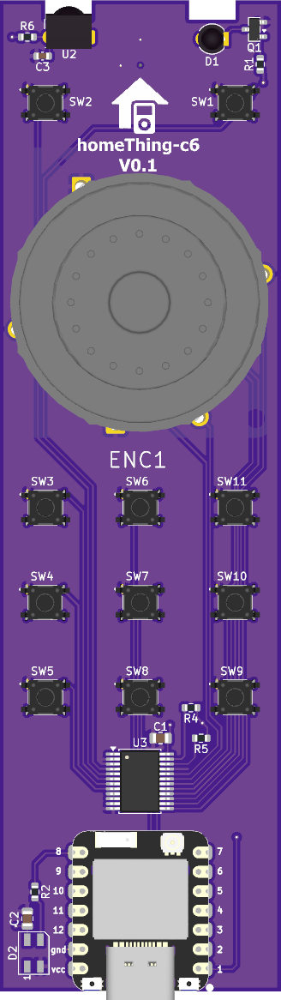
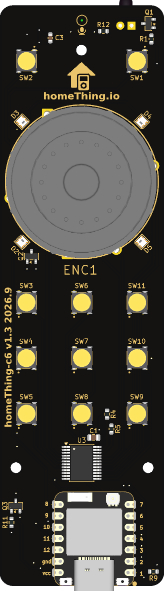
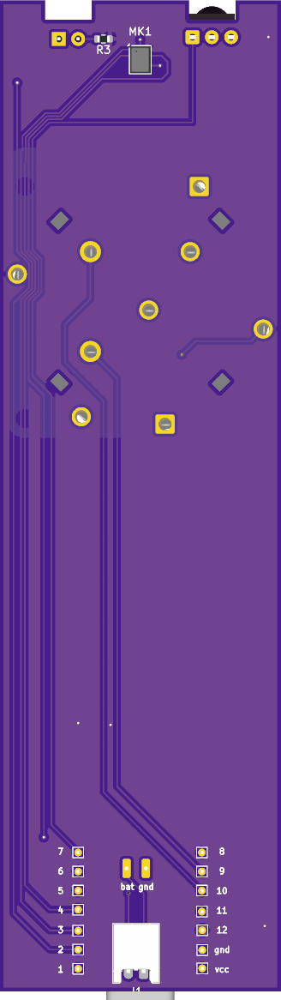
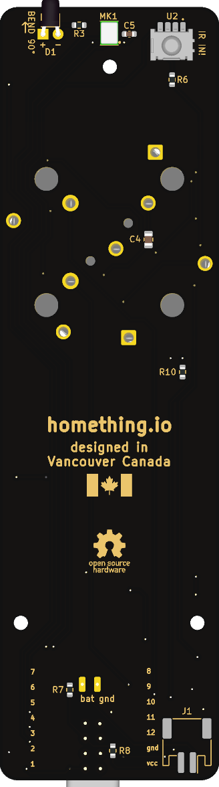

# Timeline and hardware revisions

Fabrication and bring-up history for c6remote. Design status and open work live in [`ROADMAP.md`](../ROADMAP.md); the microphone bring-up log is in [`mic-bringup.md`](mic-bringup.md).

The first assembled prototype arrived from PCBWay on Monday 2026-07-20 (order YT1753739, PCB plus SMD assembly). Bring-up found three wiring faults, all fixed in the design: ANO encoder pad 6/8 swap, TL3315 switch terminal short, ICS-43434 microphone pin numbering. Switches and encoder are reworkable on unit 1, the microphone is not, so a rev-B board is needed for the first working mic.

## Milestones

| Date | Milestone |
| --- | --- |
| 2026-06-16 | Quotation received for PCB and assembly, replied with updates; fab package finalized at `70ab9b0` (D1 and U2 swapped for PCBWay stock), tagged [v0.1](https://github.com/landonr/homething-c6/releases/tag/v0.1) |
| 2026-06-17 | Updated quotation approved; assembly order passed review |
| 2026-06-18 | Order confirmed, production queued |
| 2026-07-10 | Component engineering questions received from PCBWay |
| 2026-07-12 | Answers returned; PCBWay confirmed production is proceeding |
| 2026-07-14 | Assembled sample board photos received; PCBWay asked to confirm D1/U2 orientation before completing solder |
| 2026-07-15 | PCBWay adjusted D1 (90° lead bend firing through top-edge notch) and requested recheck |
| 2026-07-16 | D1 and full board orientation confirmed correct; assembly proceeding |
| 2026-07-20 to 2026-07-27 | First prototype delivered and brought up: PCF8575 found, TL3315 terminal short and ENC1 pad 6/8 swap root-caused and fixed in schematic and board, microphone found dead from an ICS-43434 pin-numbering fault, ANO directions measured (no 90° rotation after all), status lighting moved to a 4-LED XL-2020RGBC chain, back-silkscreen artwork added |

## Unit 1 (v0.1) versus the current design

Unit 1 is the only board that exists, and the design has moved on since it was fabbed. Everything below is a difference, so a photo or measurement from unit 1 does not describe what the next order will build. The v0.1 fab package is attached to the [v0.1 release](https://github.com/landonr/homething-c6/releases/tag/v0.1).

Quickest way to tell the two apart in a photo: the front silkscreen under the logo reads **V0.1** on unit 1 and **V0.2** on the current design.

| Unit 1, as fabbed (`70ab9b0`) | Current design (`main`) |
| --- | --- |
|  |  |
|  |  |

The right column is the live render from `scripts/render-readme-assets.sh`, so it tracks the current design. The left column is `docs/readme-assets/board-3d-*.png` as they stood at [`70ab9b0`](https://github.com/landonr/homething-c6/blob/70ab9b0be579d5dc36652c1610cfae01774bdac0/docs/readme-assets/board-3d-top.png), trimmed of the render's whitespace border so both columns scale alike, and frozen: the render script must never overwrite them. Those renders were generated at `0df2483` and the 06-16 fab commit only touched a symbol value and the BOM, so they match the delivered copper.

| Block | Unit 1, as fabbed (`70ab9b0`) | Current design |
| --- | --- | --- |
| Status lighting | One `SK6812MINI` (3.5x3.5) as D2, with R2 330Ω in series on the data line and C2 1µF decoupling | Four `XL-2020RGBC-WS2812B` (2.0x2.0) as D2-D5 in a cascade around the wheel, no series R, no decoupling caps |
| IR receiver | U2 `TSOP4136` on the front (F.Cu), two receiver cutouts in the top board edge | U2 on the back (B.Cu), both top-edge cutouts dropped |
| Discrete switches | TL3315 terminals 1/2 on `sw*` and 3/4 on GND, which shorts every populated switch input to GND | Terminals 1/2 on GND, 3/4 on `sw*` |
| ANO encoder | ENC1 pads 6 and 8 swapped, so COM_A sits on `ano_sw2` and the up switch common sits on GND | Pad 6 GND, pad 8 `ano_sw2` |
| Microphone | MK1 wired to INMP441 pin numbers, so the ICS-43434 gets the bit clock on WS and its SD pad buried in the GND pour | MK1 on the ICS-43434 numbering, `sck`/`ws`/`sd` on GPIO2/GPIO0/GPIO21 |
| Battery sense | Absent, no `bat_sense` net and no R7/R8 divider | R7/R8 100k divider to GPIO4 |
| Expander interrupt | Absent, no `exp_int` net and no R9 pull-up | R9 100k pull-up, nINT to GPIO5 |
| Battery connector | J1 through-hole `S2B-PH-K` | J1 SMD `S2B-PH-SM4-TB` |
| Board edge | Square corners, four square encoder cutouts | 3mm filleted corners, real Adafruit ANO cutout shapes |
| Silkscreen | Front homeThing logo only | Plus back artwork (flag, OSHW gear, made-in text) and a front mic-port mark |

Unit 1 hand rework so far: `sw*` traces cut and jumpered to the free terminal on all 11 switches, and ENC1 pad 6 severed from `ano_sw2` and jumpered to GND. Left, right, down, centre and both encoder channels work. Up cannot work until pad 8 is freed from the GND pour. The microphone is unreachable by rework because its SD pad is under a bottom-terminal LGA.
